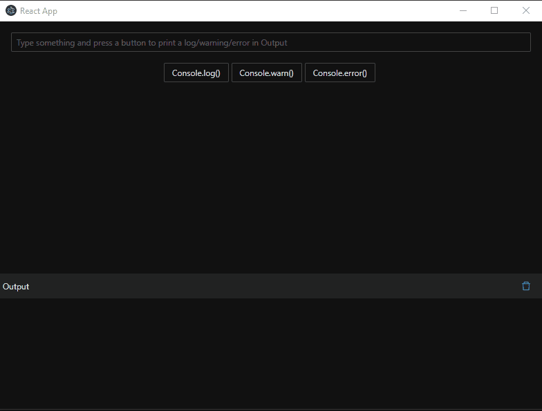

# React layout 1 (two horizontal container) with log terminal



With this layout you can find several component and a custom configuration.

If you look at `package.json` you can find:

- [antd](https://ant.design/), the design used for inputs, buttons, icons..
- [craco](https://github.com/gsoft-inc/craco), Create React App Configuration Override is an easy and comprehensible configuration layer for create-react-app. In particular can be used for antd customization. 
- [console-feed](https://github.com/samdenty/console-feed), the component used for render the output console. This component use the native `Console` methods as `console.log()`, `console.warn()`, `console.error()` for print messages, so it can be simple.
- [react-resizable-panel](https://github.com/bjgrosse/react-resize-panel), the component used for resize a container. If you use this component in strict mode, you'll see following error:
```bash
Warning: findDOMNode is deprecated in StrictMode. findDOMNode was passed an instance of Transition which is inside StrictMode. Instead, add a ref directly to the element you want to reference
```
To avoid this error, you can disable strict mode in `index.js`, removing `<React.StrictMode>` tag
- [electron](https://www.electronjs.org/). Even if electron is not used for this component, it can be useful if you want to develop a desktop app. So you can use the commands `electron:serve` for launch the application and `electron:build` for build application

## Installation

You may need `yarn`, another package manager as `npm`. If you have already installed `npm` type:
```bash
npm i yarn -g 
```
Then, install node_modules:
```bash
yarn install
```

## Usage

To start electron app launch:
```bash
yarn electron:serve
```
To build app for current operating:
```bash
yarn electron:build
```